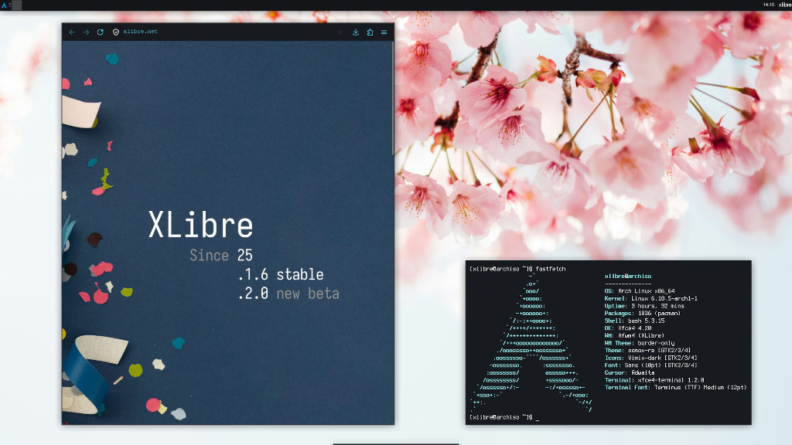

# XLibre for Arch Linux based Systems

This third-party repository provides [XLibre](https://xlibre.net) x86_64 binary  packages for [Arch Linux](https://archlinux.org/)-based systems. XLibre is the community-managed display server for the [X Window System Protocol Version 11 (Wikipedia)](https://en.wikipedia.org/wiki/X_Window_System_core_protocol), in short, X11. You can learn more about XLibre at [xlibre.net](https://xlibre.net/).

For XLibre packages for Manjaro Linux, please see [xlibre-manjaro.github.io](https://xlibre-manjaro.github.io).

## Installing XLibre Manually

### Adding the Public Package Signing Key to pacman

First, please download the public OpenPGP signing key [`xlibre-archlinux.asc`](xlibre-archlinux.asc) used to sign the packages and add it to the pacman keyring:

```shell
curl -O https://xlibre-arch.github.io/xlibre-archlinux.asc
sudo pacman-key --add xlibre-archlinux.asc
sudo pacman-key --finger B97F7C613F359424
sudo pacman-key --lsign-key B97F7C613F359424
```

You can read more about package signing on the [pacman/Package signing - ArchWiki](https://wiki.archlinux.org/title/Pacman/Package_signing#Adding_unofficial_keys) page.

### Adding the Repository to Pacman

Once you added the public key, also add an entry for the XLibre repository to the end of the file [`/etc/pacman.conf`](https://man.archlinux.org/man/pacman.conf.5) using [`sudo`](https://wiki.archlinux.org/title/Sudo) and your favorite editor:

```conf
[xlibre]
Server = https://packages.xlibre.net/arch/stable/$arch
```

Run `pacman` to update all package indexes and installed packages:

```shell
sudo pacman -Syyu
```

### Installing XLibre

Installing XLibre is as easy as installing the `xlibre-meta` package:

```shell
sudo pacman -S xlibre-meta
```

The included packages will replace any of their installed X.Org counterparts. When asked, just answer with `y `. To make use of XLibre, log out of your desktop or X session and log in again.

In case you get kicked out of a running desktop or X session while you're installing XLibre, just re-run `pacman` after you logged in again and let it install the missing packages:

```shell
sudo pacman -S xlibre-meta
```

When done, install [`xorg-xdpyinfo`](https://archlinux.org/packages/extra/x86_64/xorg-xdpyinfo) and filter its output for the `vendor` tags:

```shell
sudo pacman -S xorg-xdpyinfo
xdpyinfo | grep 'vendor'
```

It says XLibre? Congratulations!

### Support for the Legacy Proprietary Nvidia Drivers

Besides support for AMD, Intel, newer Nvidia, and many other drivers, the XLibre Xserver 25.1 series also added support for the legacy proprietary Nvidia drivers v340, v390, and v470. It is enabled in the [xlibre-xserver](https://github.com/xlibre-arch/xlibre-xserver) package by default. Please see the [NVIDIA - ArchWiki](https://wiki.archlinux.org/title/NVIDIA) page on how to install and configure the legacy proprietary Nvidia drivers. You can also find more information about the XLibre Nvidia support in the [XLibre XServer 25.1 changelog](https://github.com/X11Libre/xserver/wiki/XLibre-XServer-25.1-Changes).

### Further Information on the ArchWiki

Please see the [XLibre - ArchWiki](https://wiki.archlinux.org/title/XLibre) page for more information on the specifics of XLibre on Arch Linux, like the configuration, switching from X.Org Server, and additional software. 

## Getting in Contact

Please report any enhancement requests or issues with this repository at [Issues · xlibre-arch/xlibre-arch](https://github.com/xlibre-arch/xlibre-arch/issues). If you have a specific issue, please see the [list of package repositories](https://github.com/orgs/xlibre-arch/repositories?q=topic%3Apackage) and report it there. In case you need help, want to report success or talk about other aspects, please also check the official XLibre channels.
